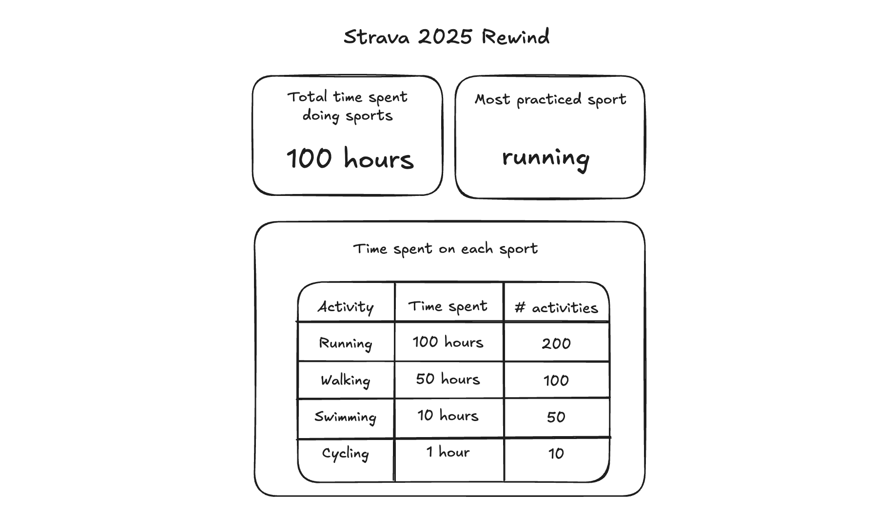

# Technical Test Sentigrate - Full Stack

## Goal

The goal of this technical test is to create a "Strava 2025 Rewind" page. The page should show the following statistics:

- Total time spent doing sports (`movingDuration`)
- Most practiced sport (most in amount of time)
- Time spent on each sport (both time spent on this sport & the number of activities for this sport)

All data can be rounded to the nearest integer.

The image below shows an example mockup of what the page should look like.

## Setup

The project is setup using Vite and uses React and TypeScript.

To start development:

- Make a clone of the repository on your local machine using `git`
- Create an environment file and add the variables which will be sent to you separately
- Make sure you have node v20 or higher installed
- Run `npm install` to install all dependencies
- Run `npm run dev` to start the local development server

## What's already provided?

- The database is stored on Supabase, an online platform that provides a Postgres database with an API or client. The connection to Supabase is already setup in the project. To get the data, you can use the provided `getActivities` function located in `src/services/garmin-data.ts`.
- The `Activity` data structure, as it will be returned from Supabase, is defined in `src/utils/types.ts`.
- Some basic styles are already provided in `src/index.css`.
  - `stats-row`: A flexbox container for each row of statistics.
  - `stats-card`: The card style for each statistic.
  - `stats-table`: The table style for displaying time spent on each sport.
